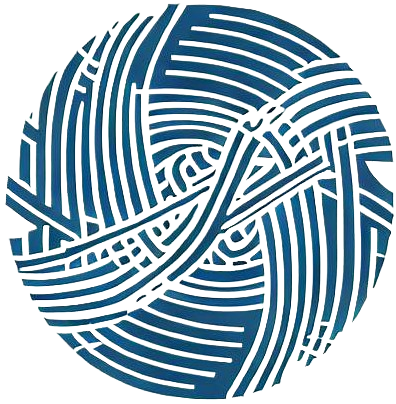

<div align="center">
  
</div>

# arMage

## idea

The idea was to build an image **CDN** that allows anybody to upload image content directly to Arweave and then have it distributed to a network of peers. The peers would then cache the images and serve them to users when requested. the idea was to have a decentralized image cdn that is fast and reliable.

## how it works

- uploading an image to Arweave is done from the front end using the Arweave-js library.
- the image is also tagged with a License and a specific tag that can help the CDN find it
- for retrieving images from Arweave, you only need to pass the txId to a single-edge server
- the edge network is a peer-to-peer network, each communicating with the other at intervals
- the edge servers are responsible for caching the images using lmdb
- the edge servers are geo-aware, able to determine the user's location and reroute the request to the edge at the closest location
- the image is retrieved from Arweave and can be transformed using JIMP library at that edge.

## architecture

**smart routing based on location**: The edge servers use websocket for p2p communication and implemented the haversine formula for finding the closest distance between two points on earth basically given a co-ordinate, represented as [lat, lon] and an array of coordinates, it finds the co-ordinate closest. this is used to determine the closest edge server to the user, and such user's request is routed to that edge server.

**caching**- image is cached to an LMDB cache using a cache key that is hashed from the query URL, the edge server is guaranteed to retrieve images from the cache as long as it exists including transformed images.

**Edge to Arweave** - currently it is `edge - to - gateway - to - Arweave.`
but it should actually be `edge -to - Arweave`. meaning the edge would be a gateway itself.

initially planned on using Distributed Hash Tables (DHT) for peer discovery, but it was not implemented due to time constraints.

the servers use IPAPI to determine the location of the user and then use the haversine algorithm to determine the closest edge server to the user.

## what is working

currently, there are 6 image transformations that you can apply to an image:

- blur (radius)
- grayscale (true/false)
- crop (x, y, width, height)
- resize (width, height)
- opacity (0-100)
- rotate (angle)

for example, if you want to transform an image to (grayscale, blur, resize), you would do:

1. `https://<edge-hostname>:<port>?img=<txId>&grayscale=true`
2. `https://<edge-hostname>:<port>?img=<txId>&blur=20`
3. `https://<edge-hostname>:<port>?img=<txId>&resize=150,150`

currently, the edge servers do not support chaining of transformations, so you can only apply one transformation at a time.

## challenges

this was a very challenging project, and we had to think outside the box to achieve some features.
we started with implementing **dht nodes**, but due to complexities, we opted for websocket only.
also, we had to learn to work with these technologies.
limited by the knowledge of rust, else, services like the [fleek](https://fleek.network) lightning network would have been explored.

## the project front-end

the front end was built with NextJS, currently, images displayed in the front end are not routed from the edge. they are pulled directly from Arweave (or Arweave gateways).

the plan is to make the UI overly simple for a cdn, showing all you want to see at a **`glance`**.

- Tailwindcss
- ArConnect
- ArweaveKit
- Arweave-js
- NextJS
- FloatUI

 are the technologies we used in the front end.

## how to run the project

```sh
# for the server
cd packages/edge

# for the client
cd packages/ui
```

### running edge servers

each server instance can be started with the following command:

```bash
GOSSIP_INTERVAL=60000 BOOTSTRAP='ws://127.0.0.1:<port>' PORT=<port>  ts-node-esm ./src/index.ts  
```

replacing the port with the port you want to run the server on.

the bootstrap is the initial edge server to retrieve peers from, if you are running multiple instances on the same machine, you can use the same port as the bootstrap.

the bootstrap server do not need a bootstrap, so you can run it with:

```bash
GOSSIP_INTERVAL=60000 PORT=<port>  ts-node-esm ./src/index.ts 
```

The following env variables are required to run the edge server:

```sh
IPAPI = ipapi secret key <get from http://api.ipapi.com>
GOSSIP_INTERVAL = time before next peer exchange default is 30 mins
BOOTSTRAP = initial edge server to retrieve peers from
PORT = e.g 3001
HOST = e.g 127.0.0.1
```

after starting the bootstrap server, you can start other instances with the same port as the bootstrap on different `PORT`'s.

### running the front end

update the environment variable with the edge you want to use.

```sh
EDGE_URL="http://127.0.0.1:3001/edge"
```

querying the edge URL from your browser would return the closest to you. To get all the edges, use `http://127.0.0.1:3001/edges`

install dependencies

```sh
pnpm install
```

run the dev server

```sh
pnpm dev
```

open `localhost:3000` to access the application

## what we tried to make to work

uploading images to Arweave from the front end following three parts

- clone from a txID
- drag and drop
- click to upload

however, we ran into issues. (it may be working though but not sure)

#### More on clone from txID

we were thinking of a way to replicate images already on Arweave without creating a copy of the original image.

here is what we came up

- **Sub-Licensing**

this would allow a third party to use an image but with the restrictions of the original image.

basically, you won't have the image, you would only own a permaweb document proving that you have access to use the image and you fulfilled conditions such as payments.
your sub-license would define the required restrictions expected from the original copy. non-limiting how you use the original image, limiting how use the image.

actually, sub-licensing isn't going to be another standard

but:

    original image
    [
      {type: "image/png"}
      {License: ...}
    ]

    copy image
    [
      {type: "document"}
      {references: "original txID"}
      {License: ... all restrictions of original image}
    ]

this approach may not be the best, we are happy to improve
